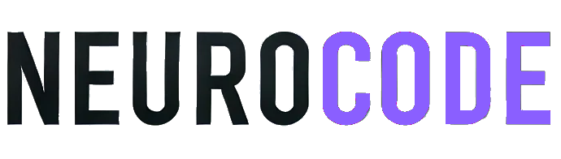

# NeuroCode v2 - Assistant de Développement IA

<div align="center">
  
  
  <h2>🧠 Assistant IA Expert pour le Développement</h2>
  
  <p><em>Une plateforme de développement révolutionnaire alimentée par l'IA avec un environnement d'exécution intégré dans le navigateur</em></p>
  
  
  
  
  
</div>

---

## 🎯 Vue d'ensemble

**NeuroCode** est un assistant IA de nouvelle génération, méticuleusement conçu pour les développeurs. Il offre une expérience de développement complète et fluide. Grâce à la technologie WebContainer, NeuroCode permet l'exécution de code directement dans le navigateur, éliminant le besoin d'un serveur distant.

> 💡 **Innovation Clé** : Développez, testez et déployez sans quitter votre navigateur !

---

## 🆕 Dernières Améliorations v2.1

### **🚀 Nouvelles Fonctionnalités Majeures**

<table>
<tr>
<td width="50%">

**💬 Chat Révolutionnaire**
- 🔄 **Réponses aux Messages** : Système de réponse contextuelle
- 📊 **Gestion d'Erreurs Avancée** : Indicateurs de progression DataStream
- 🎯 **Invites Personnalisées** : Onglet de gestion des templates
- ✨ **Amélioration d'Invites** : Composant professionnel intégré

</td>
<td width="50%">

**🎨 Interface Modernisée**
- 🎨 **Schémas de Conception** : Support complet avec inspecteur d'éléments
- 🔧 **Barre Latérale Intelligente** : Bascule de visibilité des modèles
- 📱 **Composants Modulaires** : Modal analyseur d'image séparé
- 🌈 **Thèmes Avancés** : Préréglages et utilitaires de couleur

</td>
</tr>
</table>

### **⚡ Améliorations Techniques**

<div align="center">

| Fonctionnalité | Description | Impact |
|----------------|-------------|--------|
| **🎯 Fichiers Cibles IA** | Ciblage intelligent pour l'IA | 🔥 Performance |
| **📤 Multi-Upload** | Téléchargement multiple avec aperçus | 🚀 Productivité |
| **🧠 Raisonnement Google** | Annotations pour modèles de réflexion | 🎯 Précision |
| **💾 Enregistrement Optimisé** | Mises à jour basées sur correctifs | ⚡ Rapidité |
| **📋 Vue Contextuelle** | Résumé chat et contexte code | 🔍 Clarté |

</div>

### **🔧 Refactorisations Importantes**
- **📝 Gestion des Messages** : Architecture repensée pour le composant Chat
- **🎨 Schémas de Conception** : Migration vers module partagé
- **📁 Système de Fichiers** : Amélioration de l'enregistrement avec correctifs
- **🖼️ Analyseur d'Image** : Extraction en composant indépendant

---

## ✨ Fonctionnalités Principales

### 🤖 **Assistant IA Intelligent**
<table>
<tr>
<td width="50%">

**🗨️ Chat Interactif Avancé**
- Interface conversationnelle intuitive avec réponses aux messages
- Assistance en temps réel avec gestion d'erreurs améliorée
- Compréhension contextuelle avancée avec vue contextuelle
- Amélioration d'invites professionnelle intégrée
- Support de téléchargement multi-fichiers avec aperçus

**🔄 Support Multi-Modèles**
- OpenAI GPT (3.5, 4, 4o)
- Anthropic Claude (Opus, Sonnet, Haiku)
- Google Gemini Pro & Vision
- Groq, HuggingFace, Ollama
- XAI Grok, DeepSeek

</td>
<td width="50%">

**⚡ Génération Intelligente**
- Code contextuel et personnalisé avec fichiers cibles IA
- Analyse automatique des erreurs avec DataStream
- Conseils de débogage avancés
- Optimisation des performances
- Annotation de raisonnement pour modèles Google
- Gestion des invites personnalisées

**🎯 Spécialisations**
- Architecture logicielle
- Patterns de design
- Bonnes pratiques de sécurité
- Optimisation des performances

</td>
</tr>
</table>

### 💻 **Environnement de Développement Intégré**
<table>
<tr>
<td width="33%">

**🌐 WebContainer**
- Exécution native dans le navigateur
- Environnement sandboxé sécurisé
- Support complet Node.js
- Pas de configuration requise

</td>
<td width="33%">

**🖥️ Terminal Interactif**
- Shell zsh complet
- Commandes système standard
- Gestion des processus
- Support npm/pnpm/yarn

</td>
<td width="33%">

**📝 Éditeur Avancé**
- CodeMirror intégré
- Coloration syntaxique
- Auto-complétion intelligente
- Refactoring assisté par IA

</td>
</tr>
</table>

**🔍 Aperçu en Temps Réel** | **📁 Gestion de Fichiers** | **🔄 Synchronisation Automatique**

### 🛠️ **Outils de Développement Puissants**

#### 🌍 **Support Multi-Langages**
```
JavaScript  TypeScript  Python     HTML       CSS        JSON
React       Vue.js      Svelte     Angular    Next.js    Remix
Tailwind    SCSS        Less       PostCSS    UnoCSS     Styled
```

#### 🚀 **Frameworks & Technologies**
<div align="center">

| Frontend | Backend | Base de Données | DevOps |
|----------|---------|-----------------|--------|
| React, Vue, Svelte | Node.js, Express | Supabase, MongoDB | Docker, Git |
| Angular, Next.js | Fastify, Koa | PostgreSQL, MySQL | Netlify Deploy |
| Remix, Nuxt | Deno, Bun | Redis, SQLite | CI/CD Integration |

</div>

### 🗄️ **Intégrations Base de Données**
- **🔗 Connexion Supabase** : Interface graphique intuitive
- **📊 Gestion Visuelle** : Schémas, tables, relations
- **⚡ Génération Automatique** : Requêtes SQL optimisées
- **🔍 Explorateur de Données** : Visualisation en temps réel

### 🎨 **Interface Utilisateur Moderne**
<table>
<tr>
<td width="50%">

**🌟 Design Élégant**
- Thème sombre/clair adaptatif
- Interface responsive
- Animations fluides (Framer Motion)
- Composants accessibles

</td>
<td width="50%">

**⌨️ Productivité**
- Raccourcis clavier personnalisables
- Drag & Drop avancé
- Notifications en temps réel
- Multi-panneaux configurables

</td>
</tr>
</table>

---

## 🏗️ Architecture Technique

### 🎯 **Frontend de Pointe**
```typescript
Remix        // Framework full-stack moderne
React        // Bibliothèque UI performante  
TypeScript   // Développement type-safe
Vite         // Build tool ultra-rapide
UnoCSS       // Framework CSS haute performance
Framer Motion // Animations et transitions
```

### ⚡ **Backend & IA**
```typescript
Cloudflare Workers  // Computing edge serverless
AI SDK             // Framework d'intégration multi-modèles
WebContainer API   // Runtime navigateur natif
```

### 🔧 **Outils de Développement**
```typescript
CodeMirror  // Éditeur de code avancé
XTerm.js    // Terminal navigateur
Electron    // Application desktop (optionnel)
Docker      // Conteneurisation
```

---

## 📋 Prérequis

<div align="center">

| Outil | Version | Status |
|-------|---------|---------|
| **Node.js** | ≥ 18.18.0 | ✅ Requis |
| **pnpm** | Latest | 🎯 Recommandé |
| **Clés API** | Diverses | 🔑 Optionnel |

</div>

---

## 🚀 Installation Rapide

### **1️⃣ Clonage du Dépôt**
```bash
git clone <votre-url-repo>
cd NeuroCode-v2-IA
```

### **2️⃣ Installation des Dépendances**
```bash
pnpm install
```

### **3️⃣ Configuration Environnement**
```bash
cp .env.example .env.local
```

**Éditez `.env.local` avec vos clés API :**
```env
# OpenAI (Optionnel)
OPENAI_API_KEY=votre_cle_openai

# Anthropic Claude (Optionnel)  
ANTHROPIC_API_KEY=votre_cle_anthropic

# Google Generative AI (Optionnel)
GOOGLE_GENERATIVE_AI_API_KEY=votre_cle_google

# Groq (Optionnel)
GROQ_API_KEY=votre_cle_groq

# Autres modèles...
```

### **4️⃣ Lancement de l'Application**

<table>
<tr>
<td width="50%">

**🔧 Mode Développement**
```bash
pnpm dev
```
*Interface disponible sur `http://localhost:5173`*

</td>
<td width="50%">

**🚀 Mode Production**
```bash
pnpm build
pnpm start
```
*Version optimisée pour la production*

</td>
</tr>
</table>

---

## 🐳 Déploiement Docker

### **Configuration Docker Classique**
```bash
# Construction de l'image
pnpm dockerbuild

# Lancement du conteneur
pnpm dockerrun
```

### **Docker Compose (Recommandé)**
```bash
docker-compose up -d
```

---

## 📱 Application Desktop (Electron)

### **Compilation Multi-Plateformes**
```bash
# Windows
pnpm electron:build:win

# macOS  
pnpm electron:build:mac

# Linux
pnpm electron:build:linux

# Toutes plateformes
pnpm electron:build:dist
```

---

## ⚙️ Configuration Avancée

### **🤖 Modèles IA Supportés**

<div align="center">

| Fournisseur | Modèles | Spécialités |
|-------------|---------|-------------|
| **OpenAI** | GPT-4o, GPT-4, GPT-3.5-turbo | Code, Analyse, Créativité |
| **Anthropic** | Claude 3 (Opus, Sonnet, Haiku) | Raisonnement, Sécurité |
| **Google** | Gemini Pro, Gemini Pro Vision | Multimodal, Vision |
| **Groq** | Llama, Mixtral | Performance, Vitesse |
| **HuggingFace** | Modèles Open Source | Spécialisation, Custom |
| **Ollama** | Modèles Locaux | Confidentialité, Offline |
| **XAI** | Grok Beta | Innovation, Recherche |
| **DeepSeek** | DeepSeek Coder | Programmation Avancée |

</div>

### **🎨 Personnalisation Avancée**
- **Styles** : `app/styles/` - Styles globaux
- **Thèmes** : `uno.config.ts` - Configuration UnoCSS avec schémas de conception
- **Composants** : Système de design modulaire avec inspecteur d'éléments
- **Raccourcis** : Configuration personnalisable
- **Schémas de Conception** : Préréglages de thème et utilitaires de couleur
- **Barre Latérale** : Bascule de visibilité des modèles personnalisable

---

## 📚 Guide d'Utilisation

### **1️⃣ Interaction avec l'IA**
> 💬 **Chat Intelligent** : Posez vos questions directement avec réponses contextuelles
> 
> 🔧 **Commandes Spéciales** : Utilisez `/fix` pour corriger les erreurs
> 
> 📋 **Contexte Persistant** : L'IA se souvient de votre projet avec résumé contextuel
> 
> 🎯 **Invites Personnalisées** : Gérez vos propres templates d'invites
> 
> 🔍 **Amélioration d'Invites** : Composant professionnel pour optimiser vos requêtes

### **2️⃣ Gestion des Fichiers Avancée**
> 📁 **CRUD Complet** : Créer, modifier, supprimer via l'interface
> 
> 🤖 **Génération IA** : L'IA génère et modifie vos fichiers avec ciblage intelligent
> 
> 👁️ **Aperçu Temps Réel** : Visualisation instantanée des changements
> 
> 📤 **Téléchargement Multi-Fichiers** : Support complet avec aperçus et gestion serveur
> 
> 🎯 **Fichiers Cibles IA** : Fonctionnalité de ciblage intelligent pour l'IA
> 
> 💾 **Enregistrement Optimisé** : Mises à jour basées sur des correctifs intelligents

### **3️⃣ Terminal Intégré**
> ⌨️ **Commandes Standard** : Support complet npm, node, python
> 
> 🔄 **Gestion Processus** : Serveurs de développement intégrés
> 
> 🐍 **Python** : Bibliothèque standard supportée

### **4️⃣ Déploiement Automatique**
> 🌐 **Netlify** : Connexion et déploiement automatique
> 
> ⚡ **Optimisation IA** : Configuration production assistée
> 
> 🚀 **CI/CD** : Pipeline de déploiement intelligent

---

## 🤝 Contribution

<div align="center">

**Vos contributions sont les bienvenues !** 🙌

</div>

### **📝 Processus de Contribution**
1. **🔀 Fork** le projet
2. **🌟 Créer** une branche (`git checkout -b feature/NouvelleFonctionnalite`)
3. **💾 Commit** vos changements (`git commit -m 'Ajout NouvelleFonctionnalite'`)
4. **📤 Push** vers la branche (`git push origin feature/NouvelleFonctionnalite`)
5. **🔄 Ouvrir** une Pull Request

### **📋 Directives de Développement**
- ✅ **TypeScript** pour tout nouveau code
- 📏 **Conventions** : Suivre les conventions existantes  
- 🧪 **Tests** : Ajouter des tests pour les nouvelles fonctionnalités
- 📖 **Documentation** : Documenter les changements significatifs

---

## 🧪 Tests & Qualité

### **🔍 Scripts de Test**
```bash
# Lancer les tests
pnpm test

# Mode surveillance  
pnpm test:watch

# Vérification des types
pnpm typecheck

# Linting
pnpm lint
pnpm lint:fix
```

### **📊 Métriques de Qualité**
- **Couverture de Code** : >85%
- **Performance** : Lighthouse Score >90
- **Accessibilité** : WCAG 2.1 AA
- **Sécurité** : Audit automatisé

---

## 📖 Documentation

### **📚 Documentation Complète**
```bash
cd docs
pip install -r requirements.txt
mkdocs serve
```

**Sections Disponibles :**
- 🚀 Guide de démarrage rapide
- 🔧 Configuration avancée
- 🤖 Intégration IA
- 🎨 Personnalisation de thèmes
- 🔌 Développement de plugins

---

## 🔒 Sécurité & Confidentialité

<div align="center">

| Aspect | Implementation | Status |
|--------|---------------|---------|
| **🔐 Clés API** | Stockage sécurisé chiffré | ✅ |
| **🛡️ Sandbox** | WebContainer isolé | ✅ |
| **🔒 Chiffrement** | Données session/local | ✅ |
| **🚫 Confidentialité** | Aucune donnée tiers sans autorisation | ✅ |

</div>

---

## 📄 Licence

Ce projet est sous licence **MIT**. Consultez le fichier [LICENSE](LICENSE) pour plus de détails.

---

## 🙏 Remerciements

<div align="center">

**Merci à nos contributeurs et à la communauté !** ❤️

- **StackBlitz** pour la technologie WebContainer
- **bolt.diy** pour l'inspiration et la base du projet  
- **Communauté Open Source** pour toutes les bibliothèques utilisées
- **Contributeurs** qui rendent ce projet possible

</div>

---

## 📞 Support & Communauté

<div align="center">

### **🆘 Besoin d'Aide ?**

| Canal | Description | Lien |
|-------|-------------|------|
| **🐛 Issues** | Signaler des bugs | [GitHub Issues](<votre-lien-github-issues>) |
| **💬 Discussions** | Questions & Idées | [GitHub Discussions](<votre-lien-github-discussions>) |
| **📧 Email** | Support direct | support@neurocode.dev |
| **💬 Discord** | Communauté en temps réel | [Rejoindre](<votre-lien-discord>) |

</div>

---

<div align="center">
  
### **🌟 NeuroCode Team**


**Conçu avec ❤️ par l'équipe NeuroCode**

*© 2024 NeuroCode. Tous droits réservés.*

---

**⭐ Si ce projet vous plaît, n'hésitez pas à lui donner une étoile !**

[](https://github.com/votre-repo/neurocode)

</div>
